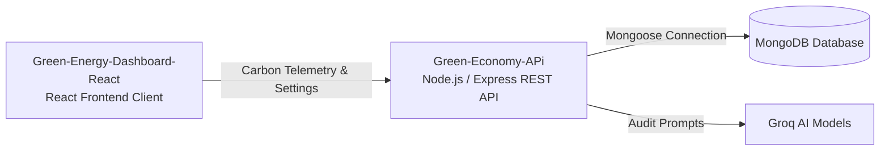

# 🌴 أهلاً بكم في منظمة الاقتصاد الأخضر | Welcome to Green-Economy Organization

  

منظمة **الاقتصاد الأخضر** هي بيئة برمجية ذكية لتطوير ومتابعة حلول التنمية المستدامة والمحافظة على البيئة. يجمع النظام بين لوحة مؤشرات تفاعلية تفصيلية لإحصائيات استهلاك الطاقة وانبعاثات الكربون وخادم خلفي متكامل لإصدار التقارير الذكية بالذكاء الاصطناعي.

**Green-Economy** is a smart development organization dedicated to building and managing sustainable energy solutions and eco-friendly products systems. The ecosystem integrates telemetry dashboard monitors, carbon offsets analytics, and AI-powered auditing reports.

---

## 🧬 النظام البيئي للمنصة | Ecosystem Architecture

يتكامل العميل الرسومي مع خادم البرمجة الخلفي لإنتاج التقارير البيئية الفورية:

---

## 📂 مستودعات المنصة (Our Repositories)

| المستودع (Repository) | النوع | الوصف (Description) | الشارات التقنية (Tech Badges) |
| :--- | :--- | :--- | :--- |
| 💻 **[Green-Energy-Dashboard-React](https://github.com/Green-Economy/Green-Energy-Dashboard-React)** | Frontend | لوحة المؤشرات التفاعلية لعرض البيانات البيئية وحساب انبعاثات الكربون وإحصائيات الطاقة. |    |
| ⚙️ **[Green-Economy-APi](https://github.com/Green-Economy/Green-Economy-APi)** | Backend | خادم البرمجة الخلفي (Express) المسؤول عن التحقق وحفظ البيانات والاتصال بالذكاء الاصطناعي. |    |

---

## 🛠️ التقنيات الأساسية (Core Tech Stack)
*   **Frontend**: React 18 layout framework, Vite compiler, Multilingual AppContext translations (RTL/LTR), custom CSS variables.
*   **Backend & DB**: Node.js v18, Express.js REST controllers routing, JWT auth session tokens, Joi validation schemas, Mongoose ODM, MongoDB database.
*   **AI Integration**: Groq Llama 3 API for smart reporting models.

---

## 👥 فريق العمل والمساهمون (Contributors)
*   **سيد حرز الله** - Lead Software Architect & Systems Developer.
